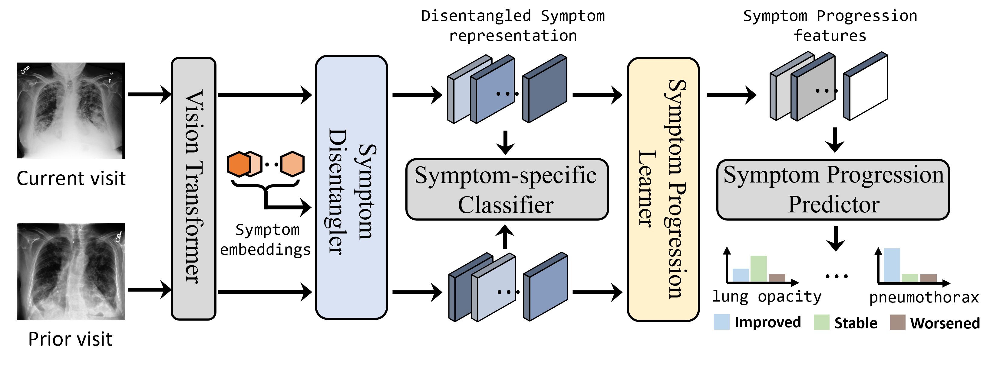

# Symptom Disentanglement in Chest X-ray Images for Fine-Grained Progression Learning
The official repo for [MICCAI'24] [**"Symptom Disentanglement in Chest X-ray Images for Fine-Grained Progression Learning"**](https://arxiv.org/pdf/2303.14175.pdf)
# Introduction
We propose a multi-stage framework to model the complex progression from symptom perspective. Specifically, we introduce two consecutive modules namely Symptom Disentangler (SD) and Symptom Progression Learner (SPL) to learn from static diagnosis to dynamic disease development. 
# Methods



## Installation
```sh
git clone https://github.com/zhuye98/SDPL.git 
cd SDPL
```
Install torch and torchvision required packages:
* torch == 2.0.0+cu118
* python == 3.8
* einops == 0.3.2


## Data Pre-processing
Step 0: Download the datasets used in this paper:
- [Chest Imagenome](https://physionet.org/content/chest-imagenome/1.0.0/)
- [MIMIC-CXR-JPG](https://physionet.org/content/mimic-cxr-jpg/2.0.0/)

Step 1: Follow [CheXRelFormer
](https://github.com/PLAN-Lab/CheXRelFormer/issues/1) for the data pre-processing, and structured as follows:

```
data
 ├─A
 ├─B
 ├─label
 ├─list
 └─split
     ├─train.csv
     ├─val.csv
     └─test.csv
```

Step 2: Extract the symptom labels and regenerate the progression label:
```
python data_processing/get_symptom_label.py
python data_processing/get_progression_label.py
```
Three files are generated, including:

- **symptom_label_chexpert.csv.** This file records the ['subject_id', 'study_id', 'dicom_id', 'path', 
                                  'Lung Opacity', 'Pleural Effusion', 'Atelectasis', 'Cardiomegaly', 
                                  'Edema', 'Pneumothorax', 'Consolidation', 'Pneumonia', 'split'] for each case;
- **symptom_label_chexpert.json.** The dictionary of symptom labels {dicom_id: symptom_list}, i.e. "dicom_id": [NaN, 0.0, NaN, NaN, 0.0, 1.0, NaN, 0.0];
- **progression_label.json.** The dictionary of symptom labels {dicom_id_cur_dicom_id_pri: progression_label_list}, i.e. "dicom_id_cur_dicom_id_pri": [NaN, NaN, NaN, NaN, NaN, NaN, NaN, 2.0], which indicates 'no change' of symptom 'Pneumonia'.

Step 3: Regenerate the split:
```
python data_processing/regenerate_split.py
```
Finally, the data is structured as follows:

```
data
 ├─A
 ├─B
 ├─label
 ├─list 
 ├─my_list 
 ├─symptom_label_chexpert.csv
 ├─symptom_label_chexpert.json
 ├─progression_label.json
 ├─split
     ├─train.csv
     ├─val.csv
     └─test.csv
```


## Training and Evaluation

```
cd code
sh scripts/run_CheXRelFormer.sh
sh scripts/run_SDPL.sh

sh scripts/eval_CheXRelFormer.sh
sh scripts/eval_SDPL.sh
```

## Acknowledgements
Our code is origin from [CheXRelFormer](https://github.com/PLAN-Lab/CheXRelFormer?tab=readme-ov-file). We are grateful to these authors for their valuable contributions.
